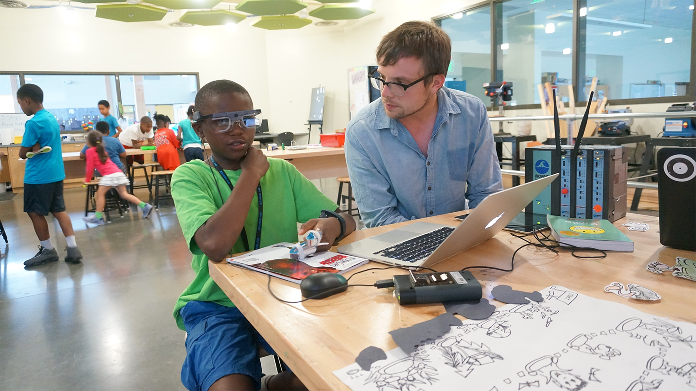
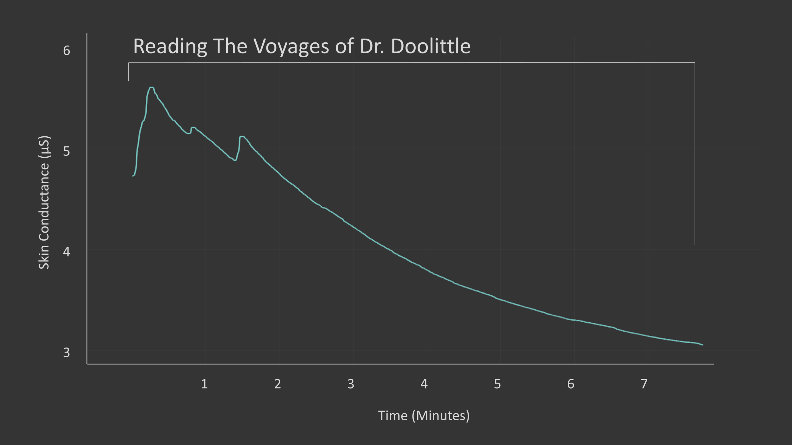
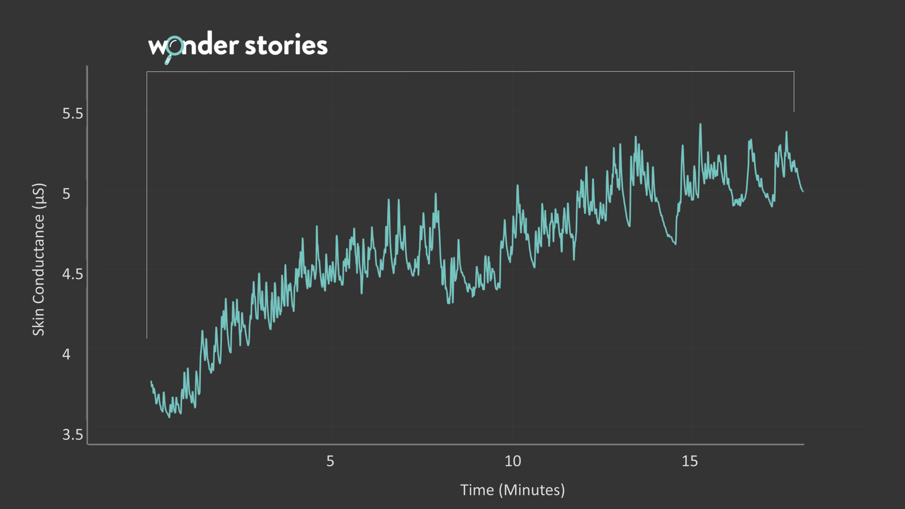
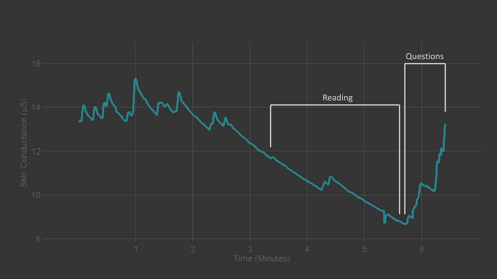
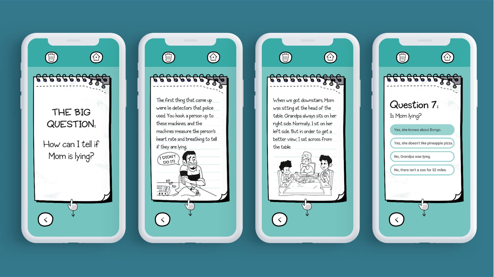
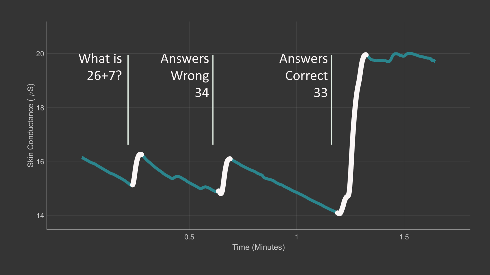
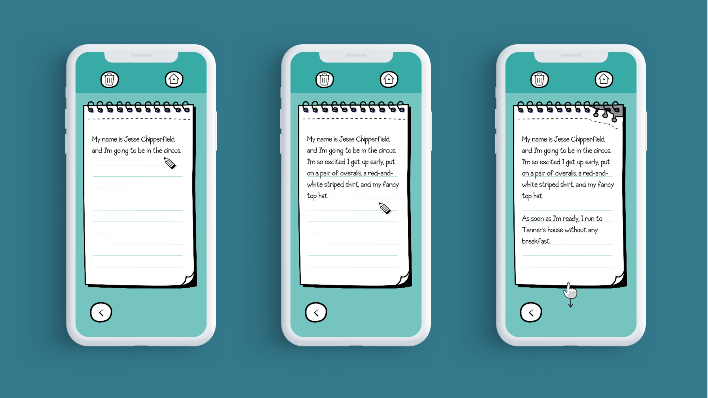

# Inquiry Based Reading
**Source:** https://bagpipe-icosahedron-ln8h.squarespace.com/research/redesignremote
**Author:** Elliott Hedman
**Date:** April 30, 2020
**Scraped:** 2026-04-17

---

For my Ph.D at the MIT Media Lab, I built a sensor that measures children's subconscious emotional experiences. With this sensor and eye tracking, I observed over 300 children at the Boys & Girls Club and Title 1 schools read digital texts.

For readers behind grade level, reading an online book was often painful.

**Image:** Ricardo becomes bored reading an early chapter book

*Source: https://images.squarespace-cdn.com/content/v1/5ea06a1f59aa2f52e63cbb9b/1588272280175-77TKLB8YJIJTYP9DJA3L/Slide7.png*

For example, this is the emotional engagement of Ricardo, a 3rd grade English language learner while he read Dr. Dolittle.

Each spike on the graph represents a moment of emotional engagement. Seven minutes in, Ricardo and Dr. Dolittle are not the best of friends. Afterwards, we found a glob of drool on the first page.

We then gave Ricardo Wonder Stories, an app we've co-created with students over the last four years of research. Below is the emotional engagement while Ricardo read about a mysterious egg in his bedroom. This story was based off of Inquiry Based Reading.

**Image:** Ricardo engages with Wonder Stories

*Source: https://images.squarespace-cdn.com/content/v1/5ea06a1f59aa2f52e63cbb9b/1588272046983-GVP4EF1E46433B0VDM44/Slide8.PNG*

The Inquiry Based Reading flipped Ricardo's experience. Each of these spikes are moments when Ricardo leans in and engages with the book.

Now that the app is publicly available, parents and teachers are emailing us daily, telling us how Wonder Stories has transformed their student's love of reading.

It's too easy to think students like Ricardo just needed to try harder. My research suggests, instead, that Ricardo needed a different reading experience, an alternative to a typical chapter book.

Below I describe how Wonder Stories was able to create engagement through Inquiry Based Reading where other books failed. I hope you'll agree, that digital reading is overdue for a much-needed makeover.

---

## 5 Features of Inquiry Based Reading

### 1. Soak Stories in Critical Thinking

While wearing eye tracking glasses, struggling readers showed a consistent pattern: they would skim past all of the text on each page. But when they arrived at a question in the text, their behavior flipped; students would carefully read the question and corresponding answers 2 to 3 times. Questions were a black hole for children's attention.

Our emotion sensors told a similar story: questions were the strongest engager in reading.

We started to design ways to hide these black hole questions, which worked, kind of…

But after one frustrating prototype, I asked my brother and co-researcher: "Too bad we can't just make the entire story a question… wait a second, why can't we?"

Today, each book in Wonder Stories starts with a question: Why is the food rotting? Is the dinosaur bus driver going to eat me? We named this question-focused story pedagogy **Inquiry Based Reading**.

Each section of a story starts with a question, has the student discover the answer while reading a short passage, and then has the reader answer the question.

**Image:** In Monkeys and Lies, a child tries to determine if his mother is lying by learning about lie detectors.

*Source: https://images.squarespace-cdn.com/content/v1/5ea06a1f59aa2f52e63cbb9b/1588272119549-BYCW2TNIZCR7STYAR6LW/Slide10.PNG*

---

### 2. Make Reading Feel Like Math: Positive Feedback Everywhere

Here is the emotional engagement of a girl solving double digit addition for the first time.

*Source: https://images.squarespace-cdn.com/content/v1/5ea06a1f59aa2f52e63cbb9b/1588272426480-XCYS3H2HJ5A3P6UMXC15/Slide12.PNG*

I've measured the emotional reactions of children playing Minecraft, building LEGOs, and collecting badges, but the emotional spike of solving a math problem is substantially higher than all of those.

In the emotional arc of math, children are given a problem, asked to think, and then are rewarded with instantaneous positive feedback.

Reading, on the other hand, has no feedback. For 200 pages there are no challenges to overcome. Books do not tell children they are rockstar readers.

In Wonder Stories, we invested in celebrating small successes in reading. Each question (and there a lot of questions) has a dancing dinosaur that appears when the child gets a problem right.

Ask most children what they think the best part of Wonder Stories is and most describe in great detail a green dinosaur that pops up and celebrates with them.

The dinosaur does not represent much more than a checkmark of completion, but having these moments of celebration transform the reading experience.

*Source: https://images.squarespace-cdn.com/content/v1/5ea06a1f59aa2f52e63cbb9b/1588272568338-DN82JFG7X7B6OZ1T4HWB/Slide13.PNG*

---

### 3. Emphasize the failure too.

> "Your first question was too easy, I knew the dog needed to be in the basket." - Bayes, 3rd grade student.

Most children's apps coddle a child when they get a problem wrong: "You're getting close, try again!" When I interviewed children about this behavior, they called the lessons "Baby Lessons". Children felt the questions were too easy, even after answering wrong.

We flipped this design. In Wonder Stories, children are directly told they got the question wrong and a sad horn plays with an frowny dinosaur. Rather than scare the child away, after getting a problem wrong, children lean in for more - they want redemption!

In the newest stories we are writing, I'm making sure even adults can't guess the answer without first reading the text—each problem needs to make kids feel awesome when they finally get it right.

---

### 4. Make Learning Bite Sized

When we are just starting to read, seeing a whole page of text can feel intimidating—no way am I going to get through that. Our eye tracking showed that questions and images often distracted kids from reading: images/questions are easier to look at than hard-to-read texts. In order to make texts feel more readable, we removed all the distracting stimuli, so that children could focus on the text alone.

We then found that the text itself could be distracting. Even just a whole paragraph of text can feel daunting. Instead, we just showed children a sentence or two at a time. Kids are shocked when we tell them that they just read a 100 page book by the end. Big tasks broken up into small pieces never feel big.

**Image:** A paragraph of text reveals slowly, one click at a time.

*Source: https://images.squarespace-cdn.com/content/v1/5ea06a1f59aa2f52e63cbb9b/1588369088401-OCUN2UXOPCZTPYR54I0A/Slide20.PNG*

---

### 5. Stimulate All of the Senses

A while back, I researched how to make classical concerts more accessible to adults. Even though the music was nice to listen to, after 3 to 5 minutes novice listeners started having trouble focusing on the music. However, stimuli like the physical act of clapping, a visual video playing, or being able to drink a beer helped attendees reengage. The best way to help someone focus on music is to engage all of the other senses, beside just sound.

For a child reading, the text itself may be hard to stay focused on, so we gave them other stimuli to reengage with. Each page needs to be physically torn from the notebook. A big ripping sound is played and the phone vibrates loudly. It's by design, not coincidence, that the dinosaur celebration screen is filled with clapping.

*Source: https://images.squarespace-cdn.com/content/v1/5ea06a1f59aa2f52e63cbb9b/1588290192883-5QAIAZGSVVKDTEP9Y0HP/Slide14.PNG*

---

## Where to Next?

Far too many children believe they are bad at reading. We lean heavily on teachers and parents to look over kids' shoulders with a proverbial whip and tell them to just "deal with it". Right now with teachers remote and parents working, this strategy is failing.

We need to give children a new reading experience. I built Wonder Stories because all children should experience the love of reading. I want children to be proud of what they learned, and identify as rockstar readers and learners. Teachers are the first step to fostering a love for reading, and I think we can help them along the way by designing reading experiences that naturally engage.

It's my hope that this article has given you proof and hope that reading can be engaging for all readers—we just have to tweak what the book looks like from the days of Gutenberg.
